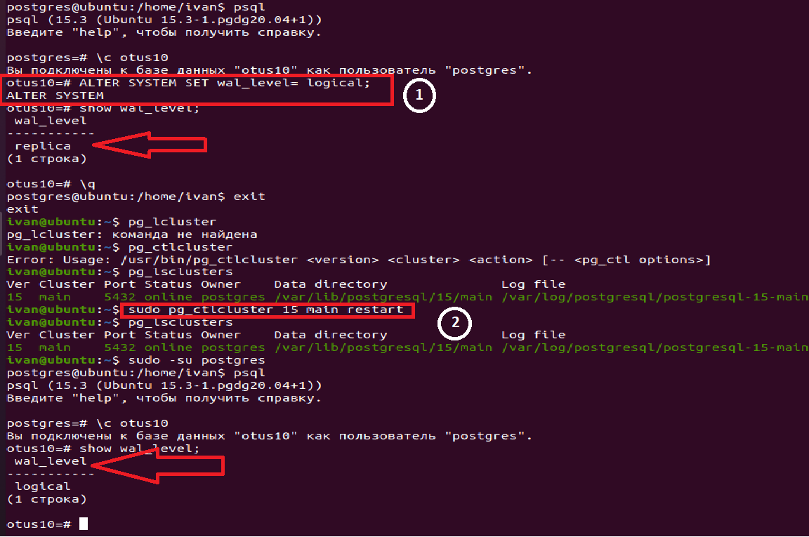
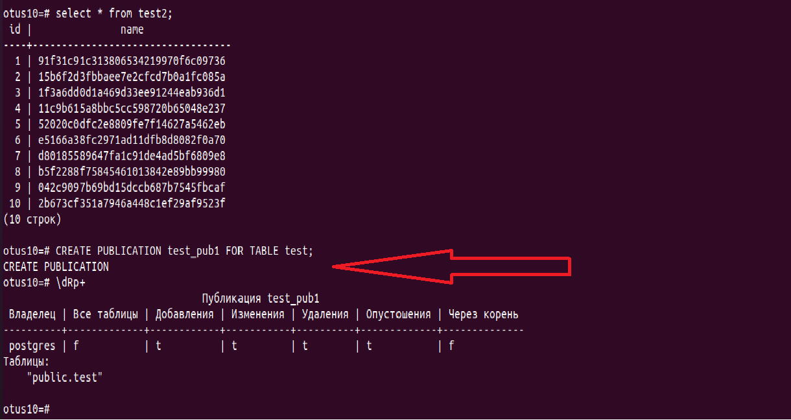
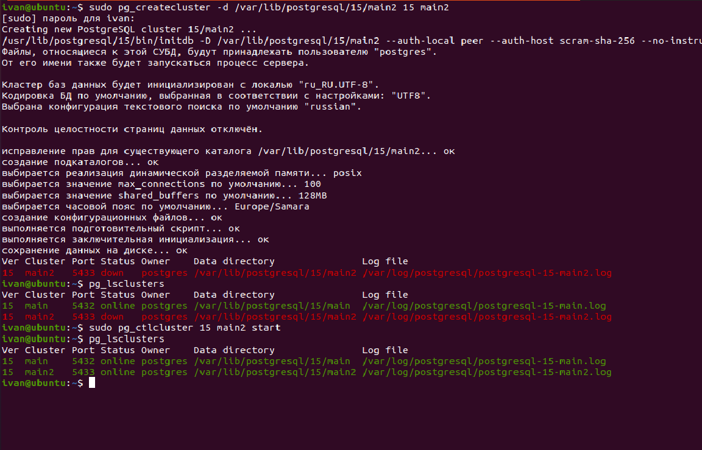
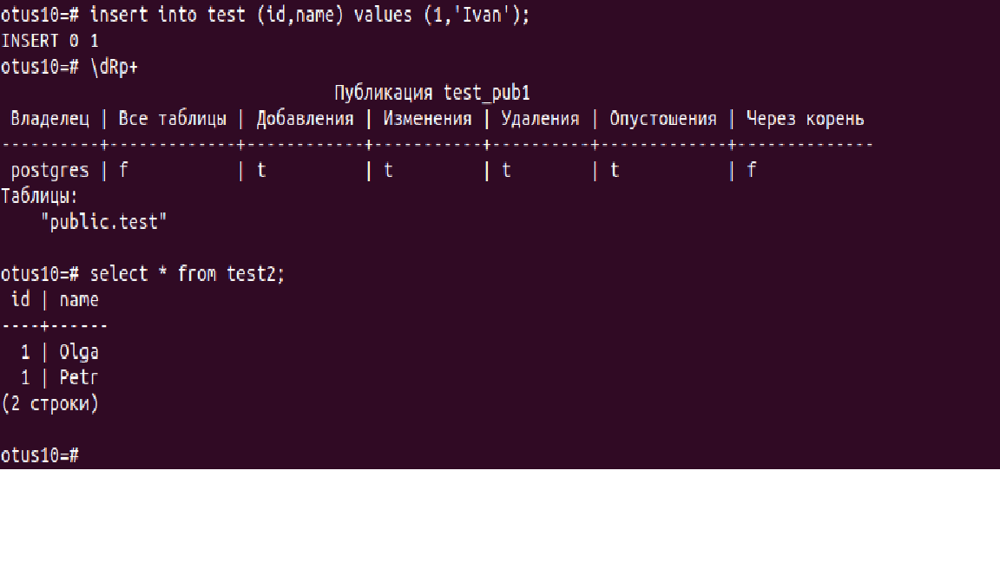
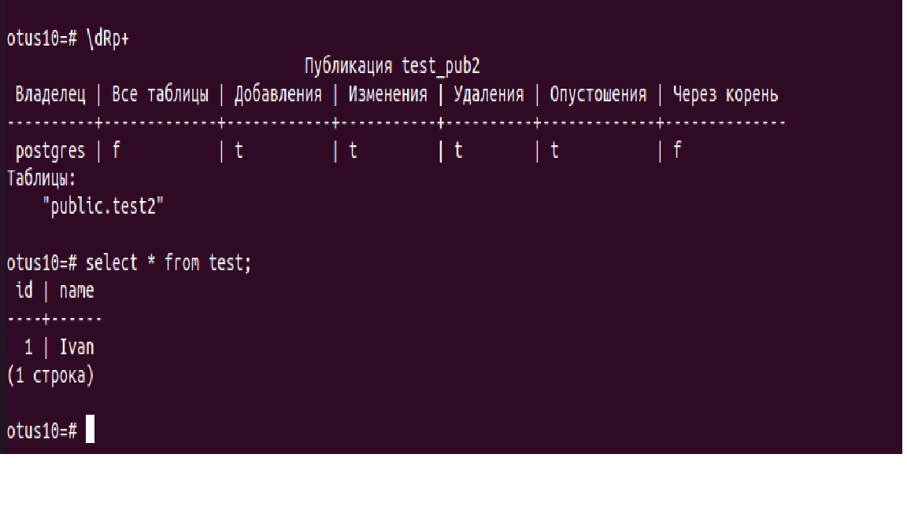
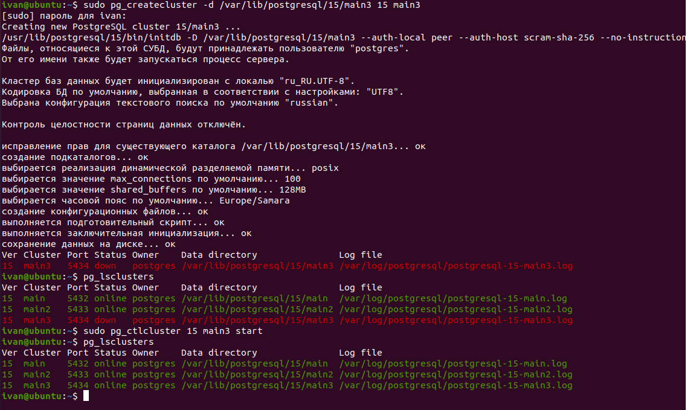
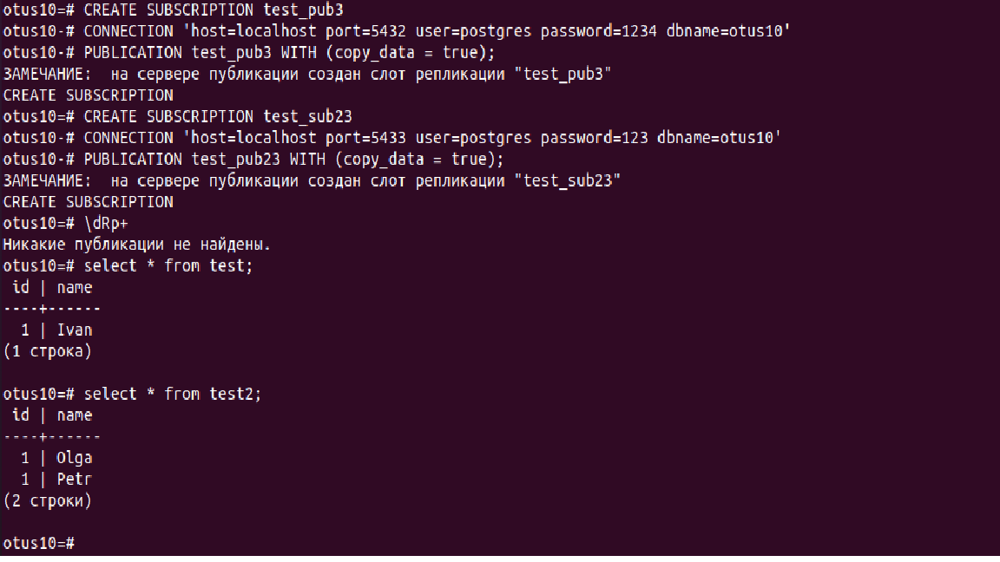

## **Репликация**

**1. На 1 ВМ создаем таблицы test для записи, test2 для запросов на чтение.**</br>
```postgres
ALTER SYSTEM SET wal_level= logical;
sudo pg_ctlcluster 15 main restart
```
 

```postgres
CREATE TABLE test (id int, name varchar);

CREATE TABLE test2 (id int, name varchar);
```
**2. Создаем публикацию таблицы test и подписываемся на публикацию таблицы test2 с ВМ №2.**</br>
```postgres
CREATE PUBLICATION test_pub1 FOR TABLE test;
\dRp+
\password
```
 
Создаем второй кластер:
```postgres
sudo pg_createcluster -d /var/lib/postgresql/15/main2 15 main2
```
 

**3. На 2 ВМ создаем таблицы test2 для записи, test для запросов на чтение.**</br>

```postgres
CREATE DATABASE otus10;
ALTER SYSTEM SET wal_level= logical;
sudo pg_ctlcluster 15 main2 restart
```
Создаем таблицы на ВМ2:
```postgres
CREATE TABLE test2 (id int, name varchar);

CREATE TABLE test (id int, name varchar);
```
**4. Создаем публикацию таблицы test2 и подписываемся на публикацию таблицы test1 с ВМ №1.**</br>
```postgres
CREATE PUBLICATION test_pub2 FOR TABLE test2;
\dRp+
\password
```
Создаем подписку с ВМ2 на ВМ1
```postgres
CREATE SUBSCRIPTION test_sub1 
CONNECTION 'host=localhost port=5432 user=postgres password=1234 dbname=otus10' 
PUBLICATION test_pub1 WITH (copy_data = true);
```
Создаем подписку с ВМ1 на ВМ2
```postgres
CREATE SUBSCRIPTION test_sub2 
CONNECTION 'host=localhost port=5433 user=postgres password=123 dbname=otus10' 
PUBLICATION test_pub2 WITH (copy_data = true);
```
Проверяю, что репликация работает:
На ВМ2 в таблицу test2 вставляю пару записей:
```postgres
insert into test2(id,name) values (1,'Olga');
insert into test2(id,name) values (1,'Petr');
```
 
На ВМ1 в таблице test2 записи также появились

На ВМ1 в таблицу test вставляю запись 
```postgres
insert into test (id,name) values (1,'Ivan');
```
 
В ВМ2 запись также появилась.

**5. 3 ВМ использовать как реплику для чтения и бэкапов (подписаться на таблицы из ВМ №1 и №2 ).**</br>

Создаем третий кластер:
```postgres
sudo pg_createcluster -d /var/lib/postgresql/15/main3 15 main3
```
 

```postgres
CREATE DATABASE otus10;
CREATE TABLE test2 (id int, name varchar);
CREATE TABLE test (id int, name varchar);
```
На ВМ1 создаем новую публикацию для таблицы test
```postgres
CREATE PUBLICATION test_pub3 FOR TABLE test;
```
На ВМ2 создаем новую публикацию для таблицы test2
```postgres
CREATE PUBLICATION test_pub23 FOR TABLE test2;
```

На BM3 создаем подписку на test_pub3 и на test_pub23:
```postgres
CREATE SUBSCRIPTION test_pub3 
CONNECTION 'host=localhost port=5432 user=postgres password=1234 dbname=otus10' 
PUBLICATION test_pub3 WITH (copy_data = true);

CREATE SUBSCRIPTION test_sub23 
CONNECTION 'host=localhost port=5433 user=postgres password=123 dbname=otus10' 
PUBLICATION test_pub23 WITH (copy_data = true);
```
 
Как только была создана подписка, так сразу в таблицах ВМ3 появились записи ищ таблиц ВМ1 и ВМ2.