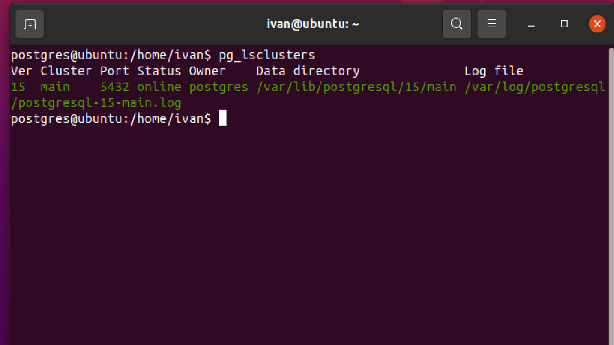
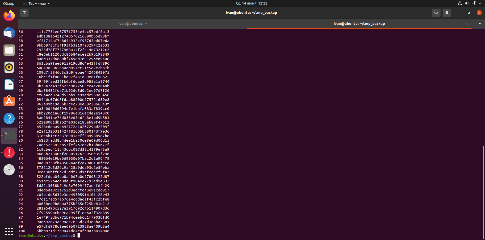
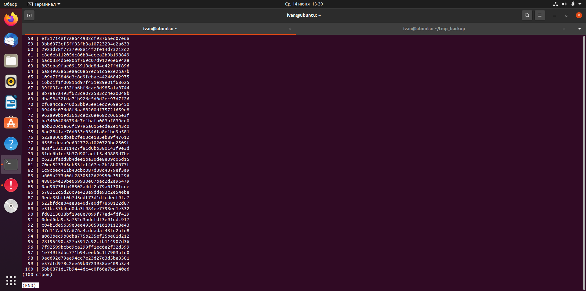

## **Бэкапы**

**1. Создаем ВМ/докер c ПГ.**</br>
 

**2. Создаем БД, схему и в ней таблицу.**</br>
```postgres
CREATE DATABASE otus;
\c otus
CREATE SCHEMA sch_otus;
\dn
CREATE TABLE sch_otus.test (id int, name varchar);
```
**3. Заполним таблицы автосгенерированными 100 записями.**</br>
```postgres
insert into sch_otus.test 
select generate_series(1,100), md5(random()::text); 
```
**4. Под линукс пользователем Postgres создадим каталог для бэкапов**</br>
```
mkdir tmp_backup
cd tmp_backup/
```

**5. Сделаем логический бэкап используя утилиту COPY**</br>
```postgres
\copy sch_otus.test to 'tmp_backup/bk_test.sql';
```
При первом запуске COPY выдавало сообщение, что "tmp_backup/bk_test.sql: Отказано в доступе". Дал права для пользователей на папку: chmod 777 tmp_backup/</br>
После этого бэкап сформировался.</br>
Проверяем: 
```postgres
cat bk_test.sql
```
 

**6. Восстановим во вторую таблицу данные из бэкапа.**</br>
```postgres
create table sch_otus.test_2(id int, name varchar);

\copy sch_otus.test_2 from 'tmp_backup/bk_test.sql';

select * from sch_otus.test_2;
```
 
**7. Используя утилиту pg_dump создадим бэкап в кастомном сжатом формате двух таблиц**</br>
```
sudo -su postgres
pg_dump -t 'sch_otus.test*' -Fc otus > bk_2.dump
```


**8. Используя утилиту pg_restore восстановим в новую БД только вторую таблицу!**</br>
Для начала нужно создать новую БД и схему:
```postgres
CREATE DATABASE otus2;
/c otus2
CREATE SCHEMA sch_otus;
```
Смотрим список:
```
sudo -su postgres pg_restore -l bk_2.dump > beckup2.list
cat beckup2.list
```

Видим следующую картину:
```
; Archive created at 2023-06-14 13:10:19 +04
;     dbname: otus
;     TOC Entries: 8
;     Compression: -1
;     Dump Version: 1.14-0
;     Format: CUSTOM
;     Integer: 4 bytes
;     Offset: 8 bytes
;     Dumped from database version: 15.3 (Ubuntu 15.3-1.pgdg20.04+1)
;     Dumped by pg_dump version: 15.3 (Ubuntu 15.3-1.pgdg20.04+1)
;
;
; Selected TOC Entries:
;
216; 1259 16429 TABLE sch_otus test postgres
215; 1259 16422 TABLE sch_otus test_2 postgres
3330; 0 16429 TABLE DATA sch_otus test postgres
3329; 0 16422 TABLE DATA sch_otus test_2 postgres
```
В файле комментируем символом ";" 216 и 3330 позиции, чтоб исключить первую таблицу.

Восстанавливаем:
```
sudo -su postgres pg_restore -d otus2 -U postgres -L beckup2.list bk_2.dump
```
Проверяем первую таблицу: 
```postgres
select * from sch_otus.test;
```
Выдает ошибку: ERROR:  relation "sch_otus.test" does not exist

Проверяем вторую таблицу:
```postgres
select * from sch_otus.test_2;
```
Она есть, что и требовалось восстановить:
 