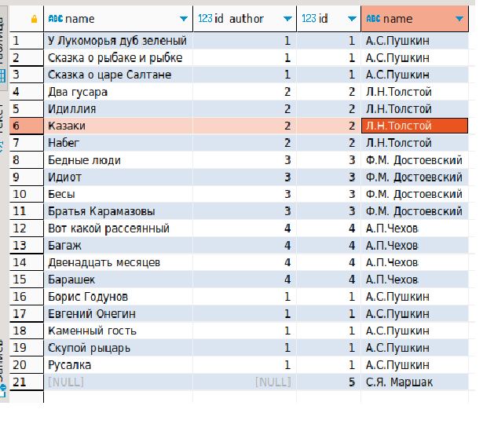

## **Работа с индексами, join'ами, статистикой**

**1 вариант: Создать индексы на БД, которые ускорят доступ к данным.**</br>
1. Создать индекс к какой-либо из таблиц вашей БД</br>
```postgres
--создаем таблицу
create table tab_otus (
    id int,
    user_id int,
    p_date date,
    status text,
    some_text text
);

insert into tab_otus(id, user_id, p_date, status, some_text)
select generate_series, (random() * 70), date'2019-01-01' + (random() * 300)::int as order_date
        , (array['returned', 'completed', 'placed', 'shipped'])[(random() * 4)::int]
        , concat_ws(' ', (array['go', 'space', 'sun', 'London'])[(random() * 5)::int]
            , (array['the', 'capital', 'of', 'Great', 'Britain'])[(random() * 6)::int]
            , (array['some', 'another', 'example', 'with', 'words'])[(random() * 6)::int]
            )
from generate_series(1,1000000);
```
Проверяем план запроса:
 
```postgres
---Создаем Индекс по полю id
CREATE INDEX ind_otus_id ON tab_otus(id);
```
2. Прислать текстом результат команды explain, в которой используется данный индекс
 
Итог: Во втором случае, плнировщик использует Index Scan вместо Seq Scan в первом случае.
Значительно уменьшилось количество костов, время выполнения запроса сократилось. Таким образом, мы получили оптимизацию запроса.</br>  

3. Реализовать индекс для полнотекстового поиска
```postgres
---Удаляем старый индекс и создаем новый для полнотекстового поиска
drop INDEX ind_otus_id;
---добавим новую колонку для поиска по to_tsquery и проапдетим ее 
alter table tab_otus add column some_text_lexeme tsvector;
update tab_otus
set some_text_lexeme = to_tsvector(some_text);

---План запроса будет выглядеть след. образом например по слову 'sun':
```
 

```postgres
---Теперь создадим индекс и посмотрим еще раз план запроса
CREATE INDEX otus_index ON tab_otus
USING GIN (some_text_lexeme);
---План запроса будет выглядеть след. образом c индексом по слову 'sun':
```
 
Итог: Во втором случае, плнировщик использует Bitmap Index Scan.
Значительно уменьшилось количество костов, в первом случае мы получили 149955.70 во втором 64290.37</br>

4. Реализовать индекс на поле с функцией
```postgres
---План запроса без индекса будет выглядеть след. образом:
```
 
```postgres
---Создаем Индекс по нескольким по полю some_text с функцикцией lower()
create INDEX otus_ind_fun on tab_otus(lower (some_text));
```
 
Итог:  Во втором случае, плнировщик использует Index Scan. Уменьшилось количество костов.</br>  

5. Создать индекс на несколько полей
```postgres
---План запроса без индекса будет выглядеть след. образом:
```
 
```postgres
---Создаем Индекс по нескольким полям: id и some_text
create INDEX otus_ind_sostav on tab_otus(id,some_text);
```
 
Итог: Во втором случае, плнировщик использует Index Scan вместо Seq Scan в первом случае.
Значительно уменьшилось количество костов, время выполнения запроса сократилось. Таким образом, мы получили оптимизацию запроса.</br>  

6. Описать что и как делали и с какими проблемами столкнулись</br>
Проблем при создании индексов не встретил, никакие ошибки не выпадали.
В каждом случае получал оптимизацию запросов. 


## **2 вариант: В результате выполнения ДЗ вы научитесь пользоваться различными вариантами соединения таблиц.** ##</br>
Создаем структуру данных:
```postgres
---author book
create table author
(
id integer primary key
,name varchar(1000)
);

---izdatelstvo
create table publishing_house
(
id integer primary key
,name varchar(1000)
);

---knigi
create table books (
id integer primary key
,name varchar(1000) 
,id_author integer 
,id_pub integer
,FOREIGN KEY (id_author)  REFERENCES author (Id)
,FOREIGN KEY (id_pub)  REFERENCES publishing_house (Id)
);

---Заполняем данными
insert into author (id,name) values 
(1,'А.С.Пушкин'), 
(2,'Л.Н.Толстой'), 
(3, 'Ф.М. Достоевский'), 
(4, 'А.П.Чехов'), 
(5,'С.Я. Маршак');
--5 строк

insert into publishing_house (id,name) values 
(1,'эксмо'), 
(2,'АИСТ'), 
(3, 'миф'), 
(4, 'питер'), 
(5,'речь'),
(6,'клевер');
--6 строк

insert into books (id,name,id_author,id_pub)
values (1,'У Лукоморья дуб зеленый',1,3),(2,'Сказка о рыбаке и рыбке',1,5),(3,'Сказка о царе Салтане',1,6),
(4,'Два гусара',2,1),(5,'Идиллия',2,3),(6,'Казаки',2,4),(7,'Набег',2,4),
(8,'Бедные люди',3,5),(9,'Идиот',3,5),(10,'Бесы',3,1),(11,'Братья Карамазовы',3,1),
(12,'Вот какой рассеянный',4,2),(13,'Багаж',4,3),(14,'Двенадцать месяцев',4,2),(15,'Барашек',4,6),
(16,'Борис Годунов',1,2),(17,'Евгений Онегин',1,1),(18,'Каменный гость',1,4),(19,'Скупой рыцарь',1,6),(20,'Русалка',1,6);
---20 строк
```
1. Реализовать прямое соединение двух или более таблиц
```postgres
select b.name,b.id_pub,p.id,p.name from books b
inner join publishing_house p on p.id=b.id_pub;
```
 
Мы соединяем две таблицы по полю id издательства. Каждой строке id_pub из таблицы books соответствует поле id из таблицы publishing_house. Так как поле id в таблице publishing_house уникаьлное, то и получаем 20 строк. 

2. Реализовать левостороннее (или правостороннее) соединение двух или более таблиц
```postgres
---Левостороннее соединение
select b.name,b.id_author,a.id,a.name from books b
left join author a on a.id=b.id_author;
```
 
Мы соединяем две таблицы по полю id автора. Каждой строке id_author из таблицы books соответствует поле id из таблицы author.
```postgres
---ПРавостороннее соединение
select b.name,b.id_author,a.id,a.name from books b
right join author a on a.id=b.id_author;
```
 
Присоединение происходит к таблице author, но в таблице books нет id_author = 5, поэтому и получаем доплнительную строку с null значением наименования книги. 

3. Реализовать кросс соединение двух или более таблиц
```postgres
select b.name,b.id_author,a.id,a.name from books b
cross join author a; 
```
 
Результатирующая таблица - это всевозможные комбинации строк из одной таблицы и второй. 
Например, берем первую строку из первой таблицы(подсвечено красным) и просто соединяем эту запись со всеми строками из второй таблицы, далее берем второую строку (подсвечено зеленым) из первой таблицы и соединяем все строки из второй и т.д. В итоге получаем 100 строк

4. Реализовать полное соединение двух или более таблиц
```postgres
select b.name,b.id_author,a.id,a.name from books b
full join author a on a.id=b.id_author;
```
 
В итоговую таблицу входят записи по совпадениям id-шников, затем все остальное. В итоге получаем 21 запись (20 записей из Inner join и одну запись у которой нет совпадений)

5. Реализовать запрос, в котором будут использованы разные типы соединений
```postgres
select b.name,a.name author_book,p.name pub_book from books b
right join author a on a.id=b.id_author
left join publishing_house p on p.id=b.id_pub;
```
 
Соединили книги и авторов правосторонним соединением, а затем соединяем левосторонним.
В итоге получается таблица из 21 строки, где автор 'С.Я. Маршак' не имеет id-ка в таблице books.
