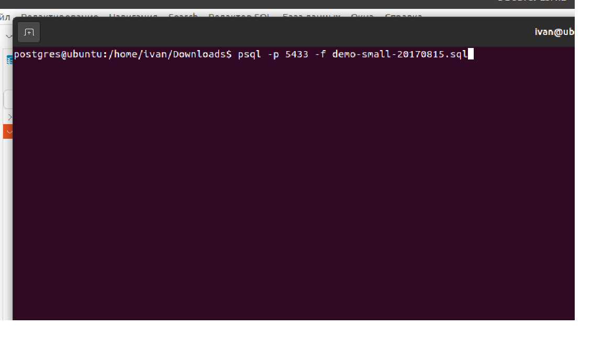
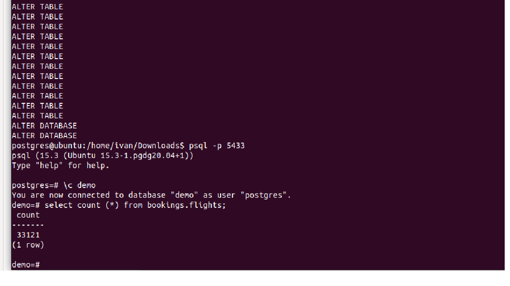
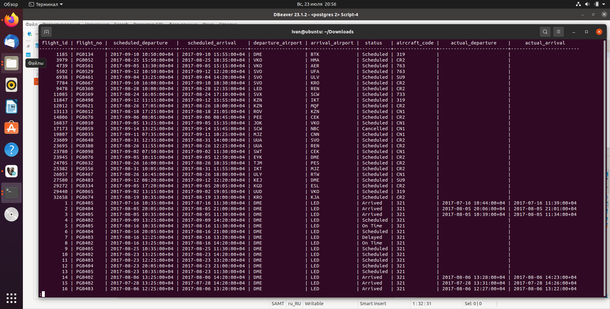
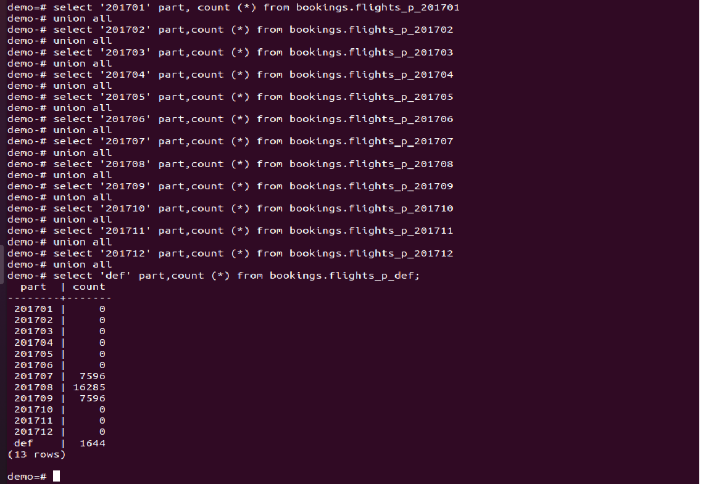

## **Секционирование таблицы**
**1.Устанавливаем демо базу**
 

**2.Смотрим, результаты установки**
 

**3.Проверяем тестовую таблицу flights и убеждаемся, что данные имеются**
 

**4. Создаем на ее основе партицированную таблицу flights_p**
```postgres
CREATE TABLE bookings.flights_p (
flight_id integer NOT NULL,
flight_no character(6) NOT NULL,
scheduled_departure timestamp with time zone NOT NULL,
scheduled_arrival timestamp with time zone NOT NULL,
departure_airport character(3) NOT NULL,
arrival_airport character(3) NOT NULL,
status character varying(20) NOT NULL,
aircraft_code character(3) NOT NULL,
actual_departure timestamp with time zone,
actual_arrival timestamp with time zone
) PARTITION BY RANGE(scheduled_departure);
```

**5. Создаем партиции**
```postgres
CREATE TABLE bookings.flights_p_201701 PARTITION of bookings.flights_p FOR values from (to_date('01.01.2017 00:00:00','dd.mm.yyyy hh24:mi:ss')) to (to_date('31.01.2017 23:59:59','dd.mm.yyyy hh24:mi:ss') );
CREATE TABLE bookings.flights_p_201702 PARTITION of bookings.flights_p FOR values from (to_date('01.02.2017 00:00:00','dd.mm.yyyy hh24:mi:ss')) to (to_date('28.02.2017 23:59:59','dd.mm.yyyy hh24:mi:ss') );
CREATE TABLE bookings.flights_p_201703 PARTITION of bookings.flights_p FOR values from (to_date('01.03.2017 00:00:00','dd.mm.yyyy hh24:mi:ss')) to (to_date('31.03.2017 23:59:59','dd.mm.yyyy hh24:mi:ss') );
CREATE TABLE bookings.flights_p_201704 PARTITION of bookings.flights_p FOR values from (to_date('01.04.2017 00:00:00','dd.mm.yyyy hh24:mi:ss')) to (to_date('30.04.2017 23:59:59','dd.mm.yyyy hh24:mi:ss') );
CREATE TABLE bookings.flights_p_201705 PARTITION of bookings.flights_p FOR values from (to_date('01.05.2017 00:00:00','dd.mm.yyyy hh24:mi:ss')) to (to_date('31.05.2017 23:59:59','dd.mm.yyyy hh24:mi:ss') );
CREATE TABLE bookings.flights_p_201706 PARTITION of bookings.flights_p FOR values from (to_date('01.06.2017 00:00:00','dd.mm.yyyy hh24:mi:ss')) to (to_date('30.06.2017 23:59:59','dd.mm.yyyy hh24:mi:ss') );
CREATE TABLE bookings.flights_p_201707 PARTITION of bookings.flights_p FOR values from (to_date('01.07.2017 00:00:00','dd.mm.yyyy hh24:mi:ss')) to (to_date('30.07.2017 23:59:59','dd.mm.yyyy hh24:mi:ss') );
CREATE TABLE bookings.flights_p_201708 PARTITION of bookings.flights_p FOR values from (to_date('01.08.2017 00:00:00','dd.mm.yyyy hh24:mi:ss')) to (to_date('31.08.2017 23:59:59','dd.mm.yyyy hh24:mi:ss') );
CREATE TABLE bookings.flights_p_201709 PARTITION of bookings.flights_p FOR values from (to_date('01.09.2017 00:00:00','dd.mm.yyyy hh24:mi:ss')) to (to_date('30.09.2017 23:59:59','dd.mm.yyyy hh24:mi:ss') );
CREATE TABLE bookings.flights_p_201710 PARTITION of bookings.flights_p FOR values from (to_date('01.10.2017 00:00:00','dd.mm.yyyy hh24:mi:ss')) to (to_date('31.10.2017 23:59:59','dd.mm.yyyy hh24:mi:ss') );
CREATE TABLE bookings.flights_p_201711 PARTITION of bookings.flights_p FOR values from (to_date('01.11.2017 00:00:00','dd.mm.yyyy hh24:mi:ss')) to (to_date('30.11.2017 23:59:59','dd.mm.yyyy hh24:mi:ss') );
CREATE TABLE bookings.flights_p_201712 PARTITION of bookings.flights_p FOR values from (to_date('01.12.2017 00:00:00','dd.mm.yyyy hh24:mi:ss')) to (to_date('31.12.2017 23:59:59','dd.mm.yyyy hh24:mi:ss') );
create table bookings.flights_p_def partition of bookings.flights_p default;
```
**6. Проверим результат**
```postgres
select '201701' part, count (*) from bookings.flights_p_201701
union all
select '201702' part,count (*) from bookings.flights_p_201702
union all
select '201703' part,count (*) from bookings.flights_p_201703
union all
select '201704' part,count (*) from bookings.flights_p_201704
union all
select '201705' part,count (*) from bookings.flights_p_201705
union all
select '201706' part,count (*) from bookings.flights_p_201706
union all
select '201707' part,count (*) from bookings.flights_p_201707
union all
select '201708' part,count (*) from bookings.flights_p_201708
union all
select '201709' part,count (*) from bookings.flights_p_201709
union all
select '201710' part,count (*) from bookings.flights_p_201710
union all
select '201711' part,count (*) from bookings.flights_p_201711
union all
select '201712' part,count (*) from bookings.flights_p_201712
union all
select 'def' part,count (*) from bookings.flights_p_def;
```
 

в итоге, видно, что распределение между партициями выполнено успешно, цели достигнуты.
