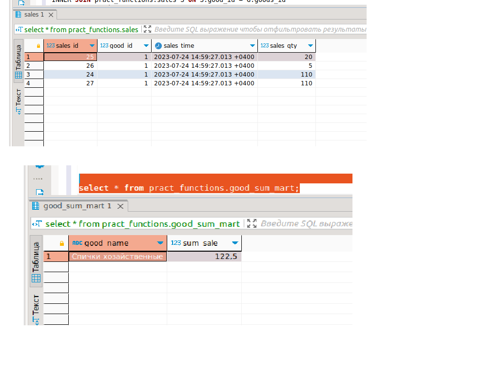

## **Триггеры, поддержка заполнения витрин**
**Разворачиваем структуру данных**
```postgres
-- ДЗ тема: триггеры, поддержка заполнения витрин

DROP SCHEMA IF EXISTS pract_functions CASCADE;
CREATE SCHEMA pract_functions;

SET search_path = pract_functions, publ

-- товары:
CREATE TABLE goods
(
    goods_id    integer PRIMARY KEY,
    good_name   varchar(63) NOT NULL,
    good_price  numeric(12, 2) NOT NULL CHECK (good_price > 0.0)
);
INSERT INTO goods (goods_id, good_name, good_price)
VALUES 	(1, 'Спички хозайственные', .50),
		(2, 'Автомобиль Ferrari FXX K', 185000000.01);

-- Продажи
CREATE TABLE sales
(
    sales_id    integer GENERATED ALWAYS AS IDENTITY PRIMARY KEY,
    good_id     integer REFERENCES goods (goods_id),
    sales_time  timestamp with time zone DEFAULT now(),
    sales_qty   integer CHECK (sales_qty > 0)
);

INSERT INTO sales (good_id, sales_qty) VALUES (1, 10), (1, 1), (1, 120), (2, 1);

-- с увеличением объёма данных отчет стал создаваться медленно
-- Принято решение денормализовать БД, создать таблицу
CREATE TABLE good_sum_mart
(
	good_name   varchar(63) NOT NULL,
	sum_sale	numeric(16, 2)NOT NULL
);
```
 
**Товары:**
 

**Продажи:**
 

**Результат отчета:**
 

**Создаем триггер на таблицу продаж pract_functions.sales**
```postgres

CREATE OR REPLACE FUNCTION pract_functions.good_fun() 
RETURNS TRIGGER AS 
$$ 
DECLARE
        p_good_price  numeric(12, 2); 
        p_good_name  varchar(63);  
        p_good_name_old  varchar(63);  
        cnt integer;
    
    BEGIN
          IF (TG_OP = 'INSERT') then
 		      select good_price,good_name into p_good_price,p_good_name from pract_functions.goods g where goods_id=NEW.good_id;  --цена и название товара
        	  select count(1) into cnt from pract_functions.good_sum_mart where good_name=p_good_name LIMIT 1;  ---есть ли уже такое наименование товара в витрине
        ----если товар уже имеется апдейтим только сумму в витрине      
	            if cnt>0 then          
          			UPDATE pract_functions.good_sum_mart 
           			SET sum_sale = (SELECT sum(G.good_price * S.sales_qty)
									FROM pract_functions.goods G
									INNER JOIN pract_functions.sales S ON S.good_id = G.goods_id and g.goods_id=NEW.good_id)
          			WHERE good_name = p_good_name;
	---если товара еще нет вставляем строчку с наименованием товара и ценой продаж       
  	  			else 
         			INSERT INTO pract_functions.good_sum_mart (good_name,sum_sale) values(p_good_name,p_good_price*NEW.sales_qty);
         	  	end if;	
        
        ELSIF (TG_OP = 'UPDATE') then
           select good_price,good_name into p_good_price,p_good_name from pract_functions.goods g where goods_id=NEW.good_id;  ----наименование и стоимость товара 
          
	---апдейт касается количества товара апдейтим цену продаж товара в витрине
          			UPDATE pract_functions.good_sum_mart 
           			SET sum_sale = (SELECT sum(G.good_price * S.sales_qty)
									FROM pract_functions.goods G
									INNER JOIN pract_functions.sales S ON S.good_id = G.goods_id and g.goods_id=NEW.good_id)
         			WHERE good_name = p_good_name;
            
        ELSIF (TG_OP = 'DELETE') THEN
           select good_price,good_name into p_good_price,p_good_name from pract_functions.goods g where goods_id=OLD.good_id;    ----наименование и стоимость товара 
		   select count(1) into cnt from pract_functions.sales where good_id=old.good_id and sales_id!=old.sales_id limit 1;  ---есть ли еще такое наименование товара в витрине, кроме удаленного

---если товар еще остался в таблице продаж, тогда просто апдейтим цену продаж товара в витрине         		
				if cnt>0 then 
          		 	UPDATE pract_functions.good_sum_mart 
           			SET sum_sale = (SELECT sum(G.good_price * S.sales_qty)
									FROM pract_functions.goods G
									INNER JOIN pract_functions.sales S ON S.good_id = G.goods_id and g.goods_id=OLD.good_id
									and sales_id!=old.sales_id)
          		 	WHERE good_name = p_good_name;

---если товара больше нет, то просто из витрины удаляем строку
                else           		
          			delete from pract_functions.good_sum_mart where good_name = p_good_name;
		  		end if;	
        END IF;  
       RETURN NULL;
    END;
$$ 
LANGUAGE plpgsql;


CREATE TRIGGER good_tr
AFTER INSERT OR UPDATE OR DELETE ON pract_functions.sales
    FOR EACH ROW EXECUTE PROCEDURE pract_functions.good_fun();
 ```   

**Проверяем инсерт, вставляем пять строчек**

```postgres
INSERT INTO pract_functions.sales (good_id, sales_qty) VALUES (2, 2), (1, 50), (1, 20), (1, 5),(1,500);
```
 
СУмма совпадает с тем, что выдает отчет скриптом.

**Проверяем delete, удаляем пять строчек**
```postgres
DELETE from pract_functions.sales where sales_id in (19,20,21,22,23);
```
 
СУмма совпадает с тем, что выдает отчет скриптом.

**Проверяем update, апдейтим 2 строчки**
```postgres
update pract_functions.sales
set sales_qty=110
where sales_id in (24,27);
```
 
СУмма совпадает с тем, что выдает отчет скриптом.