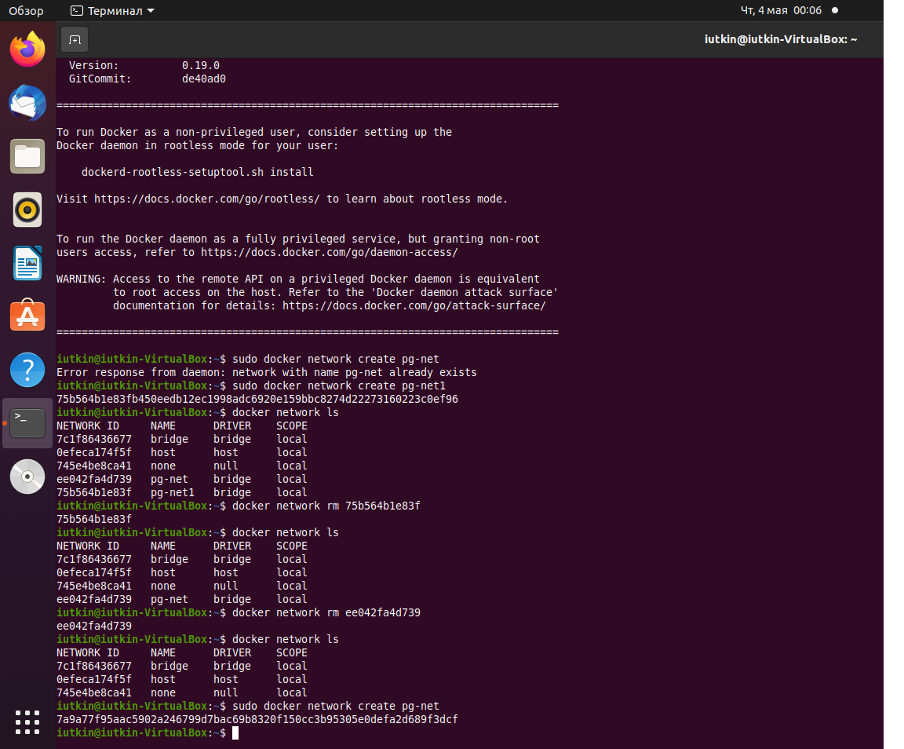
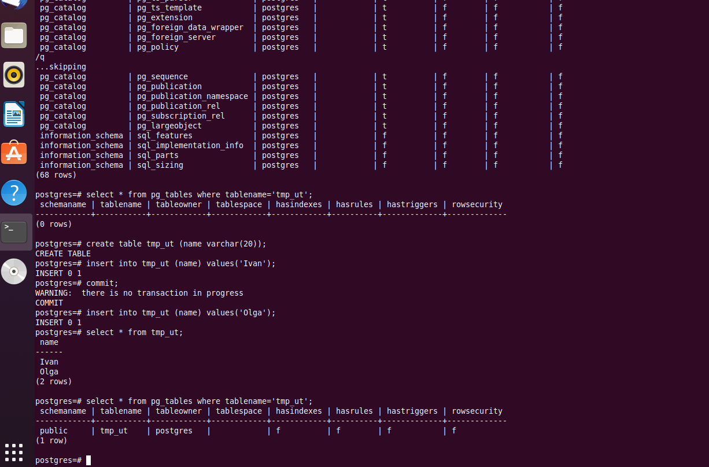
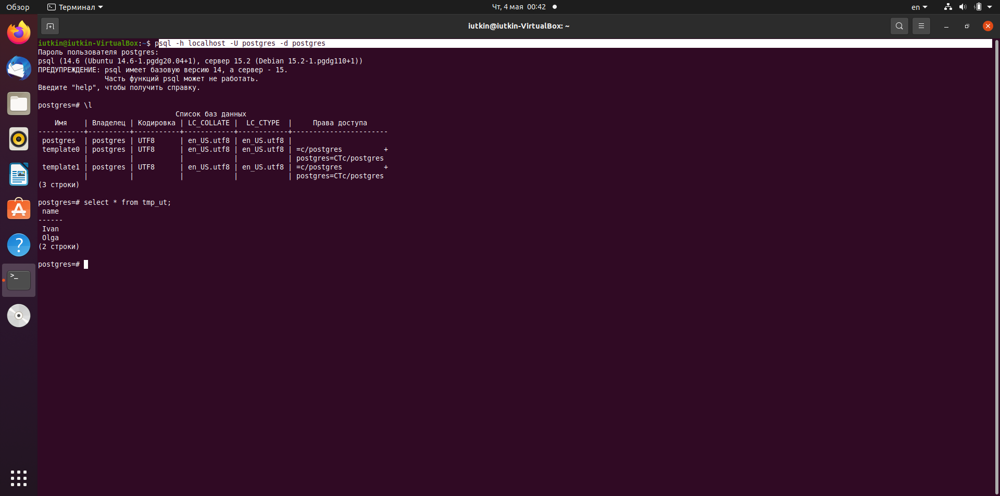
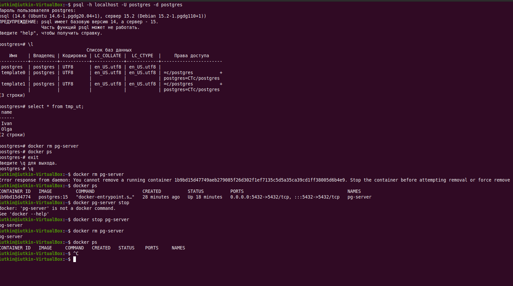
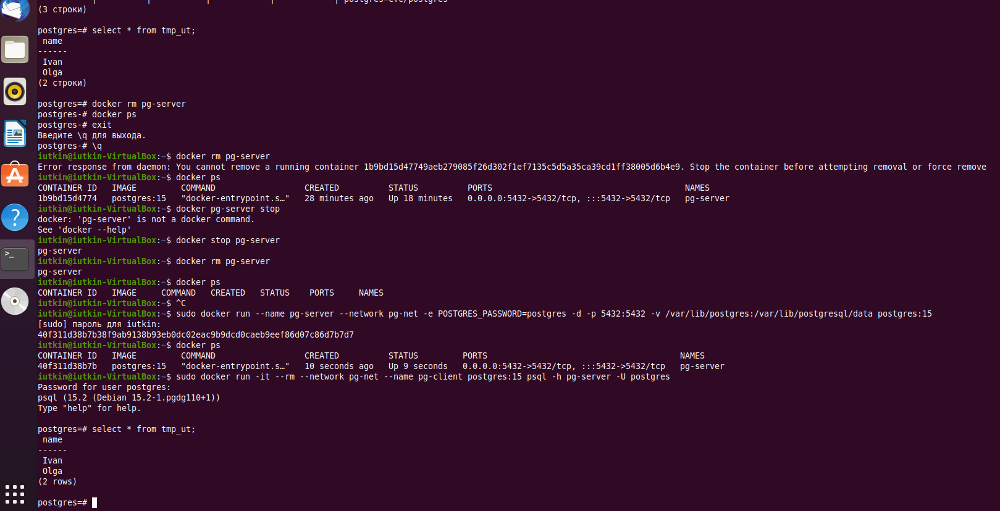

## **Установка и настройка PostgteSQL в контейнере Docker**
* создать ВМ с Ubuntu 20.04/22.04 или развернуть докер любым удобным способом.</br>
Установил VirtualBox, на которой развернул Ubuntu 20.04.
* поставить на нем Docker Engine </br>
В терминале устанавливаю Docker:</br>
```
curl -fsSL https://get.docker.com -o get-docker.sh && sudo sh get-docker.sh && rm get-docker.sh && sudo usermod -aG docker $USER
```
</br>создаем сеть:</br>
возникли некоторые трудности с установкой сети, поэтому пришлось устанавливать и удалять их, но в итоге установил сеть

```
sudo docker network create pg-net
```

 


* сделать каталог /var/lib/postgres </br>
```
mkdir /var/lib/postgres
```
* развернуть контейнер с PostgreSQL 15 смонтировав в него /var/lib/postgresql
```
sudo docker run --name pg-server --network pg-net -e POSTGRES_PASSWORD=postgres -d -p 5432:5432 -v /var/lib/postgres:/var/lib/postgresql/data postgres:15
```
У меня уже стоял postgres 14 и порт 5432 был занят, убедился в этом еще раз
```
sudo lsof -i -P -n
```
затем кильнул процесс postgres и стартанул контейнер. 
* развернуть контейнер с клиентом postgres</br>
```
sudo docker run -it --rm --network pg-net --name pg-client postgres:15 psql -h pg-server -U postgres
```
* подключится из контейнера с клиентом к контейнеру с сервером и сделать
таблицу с парой строк</br>
```postgres
create table tmp_ut (name varchar(20));
insert into tmp_ut (name) values('Ivan');
insert into tmp_ut (name) values('Olga');
```
 
* подключится к контейнеру с сервером с ноутбука/компьютера извне инстансов GCP/ЯО/места установки докера</br>
```
sql -h localhost -U postgres -d postgres
```
 
* удалить контейнер с серверомM</br>
```
docker stop pg-server
docker rm pg-server
docker ps
```
 
* создать его заново
```
sudo docker run --name pg-server --network pg-net -e POSTGRES_PASSWORD=postgres -d -p 5432:5432 -v /var/lib/postgres:/var/lib/postgresql/data postgres:15
```
* подключится снова из контейнера с клиентом к контейнеру с сервером
```
sudo docker run -it --rm --network pg-net --name pg-client postgres:15 psql -h pg-server -U postgres
```
* проверить, что данные остались на месте</br>
Записи имеются
```postgres
select * from tmp_ut;
```
 