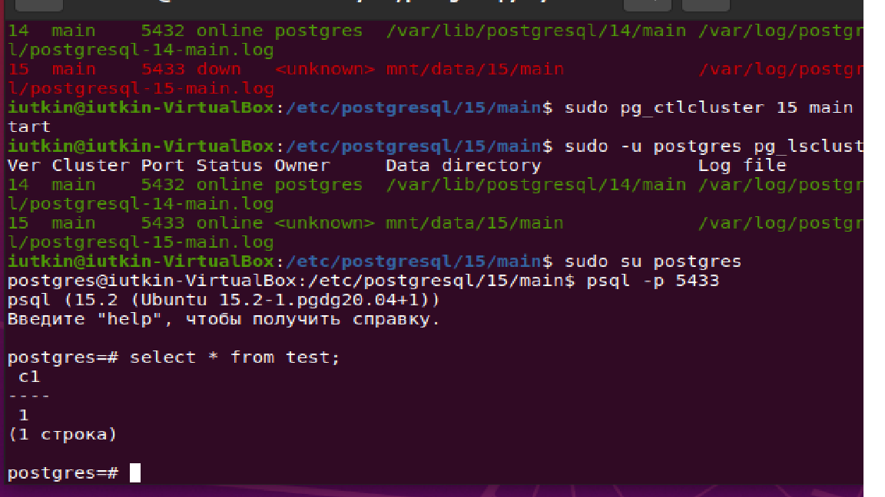

## **Установка и настройка PostgreSQL**
* создайте виртуальную машину c Ubuntu 20.04/22.04 LTS в GCE/ЯО/Virtual Box/докере 
Создал ВМ с Ubuntu на Virtual Box
* поставьте на нее PostgreSQL 15 через sudo apt 
Установил PostgreSQL 15
* проверьте что кластер запущен через sudo -u postgres pg_lsclusters 
Кроме 15 версии была у меня еще установлена 14 версия.
 
* зайдите из под пользователя postgres в psql и сделайте произвольную таблицу с произвольным содержимым
postgres=# create table test(c1 text);
postgres=# insert into test values('1');
\q
 
* остановите postgres например через sudo -u postgres pg_ctlcluster 15 main stop
 
* создайте новый диск к ВМ размером 10GB 
Диск создан
* добавьте свеже-созданный диск к виртуальной машине - надо зайти в режим ее редактирования и дальше выбрать пункт attach existing disk
* проинициализируйте диск согласно инструкции и подмонтировать файловую систему, только не забывайте менять имя диска на актуальное, в вашем случае это скорее всего будет /dev/sdb - https://www.digitalocean.com/community/tutorials/how-to-partition-and-format-storage-devices-in-linux  
Выполнил согласно инструкции
* перезагрузите инстанс и убедитесь, что диск остается примонтированным (если не так смотрим в сторону fstab)
 
* сделайте пользователя postgres владельцем /mnt/data - chown -R postgres:postgres /mnt/data/  
Сделал
* перенесите содержимое /var/lib/postgres/15 в /mnt/data - mv /var/lib/postgresql/15/mnt/data
 
* попытайтесь запустить кластер - sudo -u postgres pg_ctlcluster 15 main start
 
* напишите получилось или нет и почему 
Запуск не удался, так как в системном файле указан путь к data_directory, которого нет (мы перенесли на другое место)
* задание: найти конфигурационный параметр в файлах раположенных в /etc/postgresql/15/main который надо поменять и поменяйте его
data_directory = 'mnt/data/15/main'  
 
* напишите что и почему поменяли 
Поменял путь к данным, которые мы перенесли.
* попытайтесь запустить кластер - sudo -u postgres pg_ctlcluster 15 main start
 
* напишите получилось или нет и почему 
Получилось, так как указан корректный путь в файле postgresql.conf
* зайдите через через psql и проверьте содержимое ранее созданной таблицы
 
