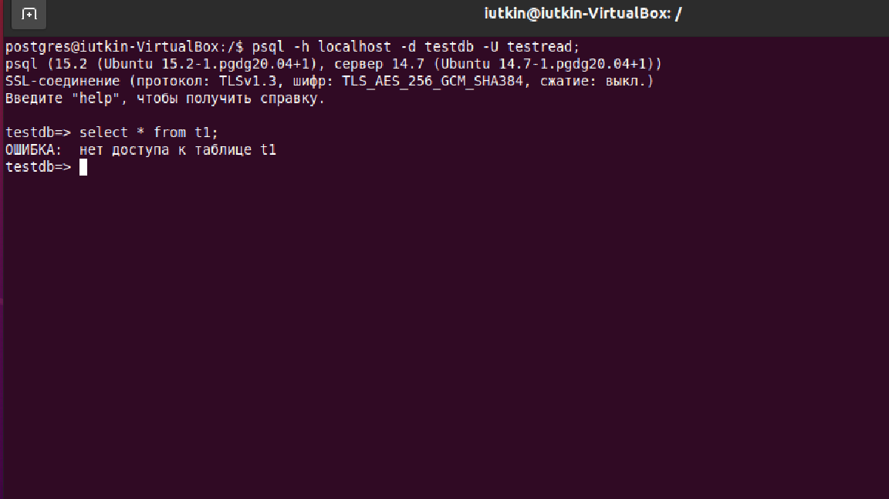
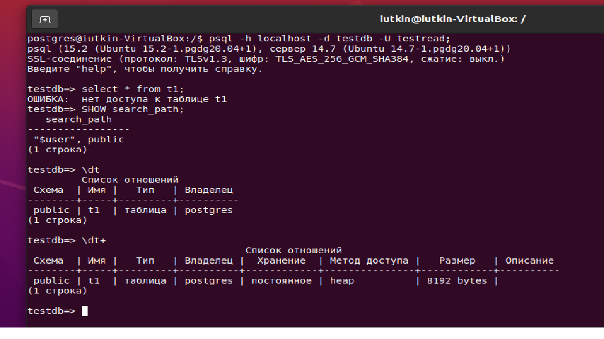
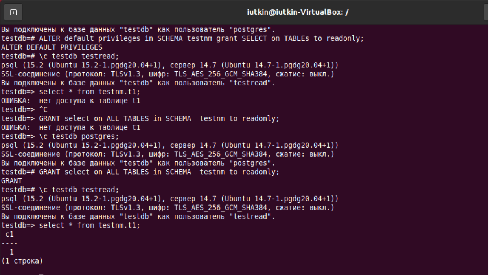

## **Работа с базами данных, пользователями и правами**

1 создайте новый кластер PostgresSQL 14</br>
Создал
2 зайдите в созданный кластер под пользователем postgres</br>
**sudo su postges</br>
psql -p 5432**</br>
3 создайте новую базу данных testdb</br>
```postgres 
CREATE DATABASE testdb;
```
4 зайдите в созданную базу данных под пользователем postgres</br>
**\c testdb**</br>
5 создайте новую схему testnm
```postgres
CREATE SCHEMA testnm;
```
6 создайте новую таблицу t1 с одной колонкой c1 типа integer
```postgres
CREATE TABLE t1(c1 int);
```
7 вставьте строку со значением c1=1
```postgres
INSERT INTO t1(c1) VALUES(1);
```
8 создайте новую роль readonly
```postgres
CREATE ROLE readonly with LOGIN PASSWORD '123456';
```
9 дайте новой роли право на подключение к базе данных testdb
```postgres
GRANT CONNECT on DATABASE testdb TO readonly;
```
10 дайте новой роли право на использование схемы testnm
```postgres
GRANT USAGE on SCHEMA testnm to readonly;
```
11 дайте новой роли право на select для всех таблиц схемы testnm
```postgres
GRANT select on ALL TABLES in SCHEMA  testnm to readonly;
```
12 создайте пользователя testread с паролем test123
```postgres
CREATE USER testread with password 'test123';
```
13 дайте роль readonly пользователю testread
```postgres
grant readonly TO testread;
```
14 зайдите под пользователем testread в базу данных testdb</br>
**sql -h localhost -d testdb -U testread;**</br>
15 сделайте select * from t1;</br>
Выдал ошибку:</br>
**ОШИБКА:  нет доступа к таблице t1**</br>
16 получилось? (могло если вы делали сами не по шпаргалке и не упустили один существенный момент про который позже)</br>
Не получилось.</br>
17 напишите что именно произошло в тексте домашнего задания</br>
 
18 у вас есть идеи почему? ведь права то дали?</br>
**таблица находится в public, у пользователя testread имеется роль readonly, роль имеет возможность подключаться к БД testdb и пользоваться схемой testnm. Но никаких прав для public мы не давали.**</br>
19 посмотрите на список таблиц
 
20 подсказка в шпаргалке под пунктом 20
21 а почему так получилось с таблицей (если делали сами и без шпаргалки то может у вас все нормально)</br>
Если смотреть в ```SHOW search_path;```</br>
то результат: **"$user", public**</br>
Это значит, что первый элемент ссылается на схему с именем текущего пользователя. Такой схемы не существует - ссылка на неё игнорируется. Тогда поиск идет на схему public. Поэтому таблица создана в public.</br>
22 вернитесь в базу данных testdb под пользователем postgres</br>
```\c testdb postgres```</br>
23 удалите таблицу t1
```postgres
DROP TABLE t1;
```
24 создайте ее заново но уже с явным указанием имени схемы testnm
```postgres
CREATE TABLE testnm.t1 (c1 int);
```
25 вставьте строку со значением c1=1
```postgres
INSERT INTO testnm.t1 (c1) values (1);
```
26 зайдите под пользователем testread в базу данных testdb</br>
```\c testdb testread```</br>

27 сделайте select * from testnm.t1;</br>
ОТвет: ОШИБКА:  нет доступа к таблице t1</br>
28 получилось?</br>
Не полуилось
29 есть идеи почему? если нет - смотрите шпаргалку</br>
Потому что мы удалили таблицу t1 И заново ее создали, прав на чтение для новой таблицы у нас нет, старые права не распространяются на новую таблицу.
30 как сделать так чтобы такое больше не повторялось? если нет идей - смотрите шпаргалку
```postgres
\c testdb postgres; 
ALTER default privileges in SCHEMA testnm grant SELECT on TABLEs to readonly; 
\c testdb testread;
```
31 сделайте select * from testnm.t1;<br>
Ответ: ОШИБКА:  нет доступа к таблице t1</br>
32 получилось?</br>
Не полуилось</br>
33 есть идеи почему? если нет - смотрите шпаргалку</br>
ALTER действует для новых таблиц, а grant SELECT для существующих. Нужно grant SELECT сделать или пересоздать таблицу. </br>
```postgres
\c testdb postgres; 
GRANT select on ALL TABLES in SCHEMA  testnm to readonly;
\c testdb testread;
```
31 сделайте select * from testnm.t1;</br>
 
32 получилось?</br>
Да</br>
33 ура!
34 теперь попробуйте выполнить команду create table t2(c1 integer); insert into t2 values (2);</br>
35 а как так? нам же никто прав на создание таблиц и insert в них под ролью readonly?</br>
схема public создается в каждой базе данных по умолчанию. И grant на все действия в этой схеме дается роли public. А роль public добавляется всем новым пользователям. Соответсвенно каждый пользователь может по умолчанию создавать объекты в схеме public любой базы данных
36 есть идеи как убрать эти права? если нет - смотрите шпаргалку</br>
```postgres
\c testdb postgres; 
revoke CREATE on SCHEMA public FROM public; 
revoke all on DATABASE testdb FROM public; 
\c testdb testread; 
```
37 если вы справились сами то расскажите что сделали и почему, если смотрели шпаргалку - объясните что сделали и почему выполнив указанные в ней команды
38 теперь попробуйте выполнить команду create table t3(c1 integer); insert into t2 values (2);</br>
ОТвет: ОШИБКА:  нет доступа к схеме public
39 расскажите что получилось и почему
Потому что мы ограничили права на создание объектов в public на шаге 36.