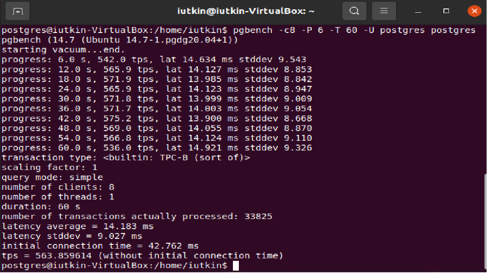
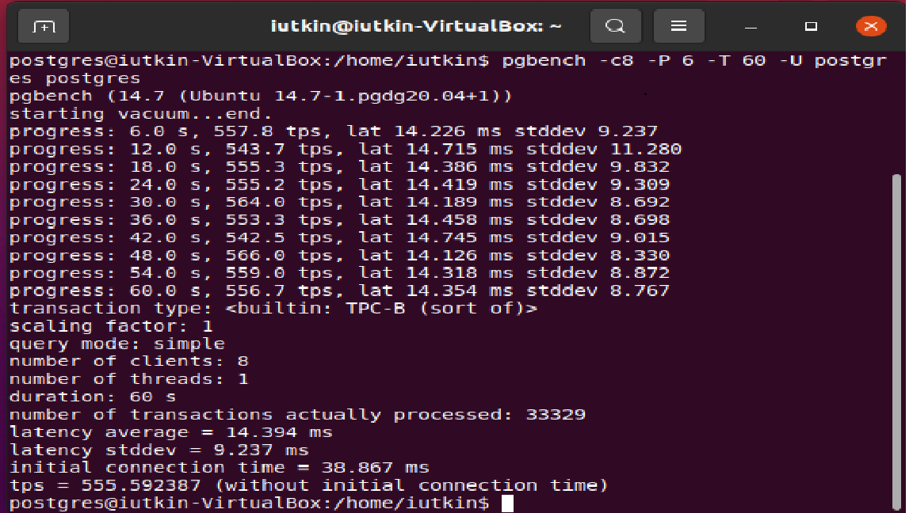
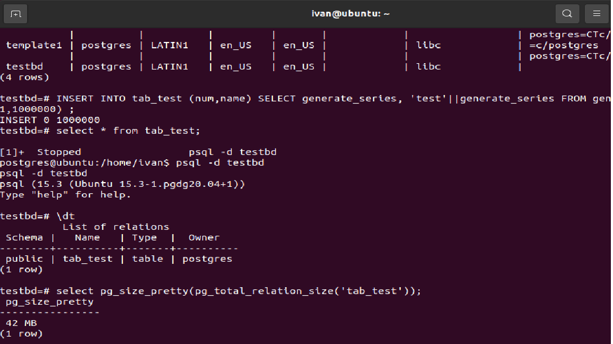
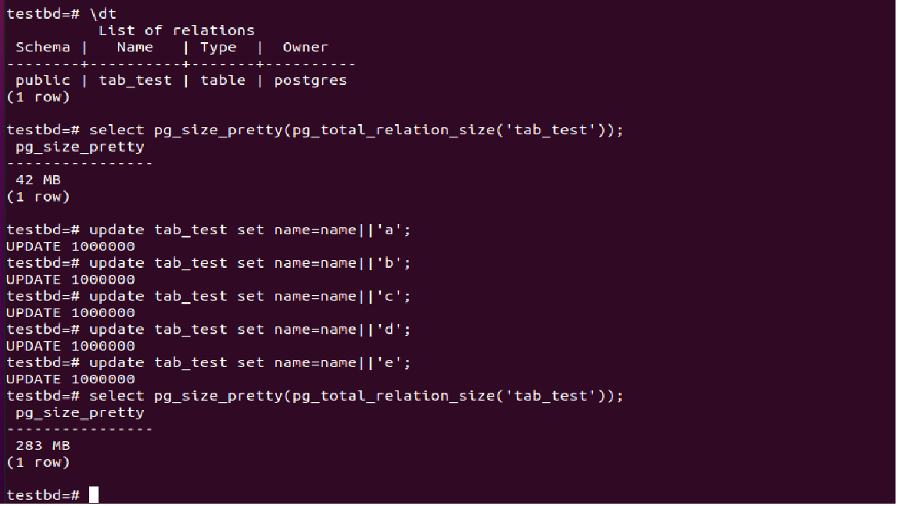
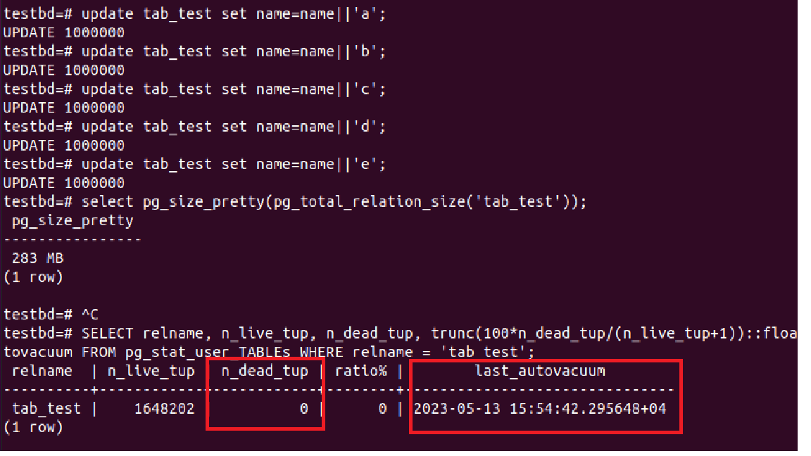
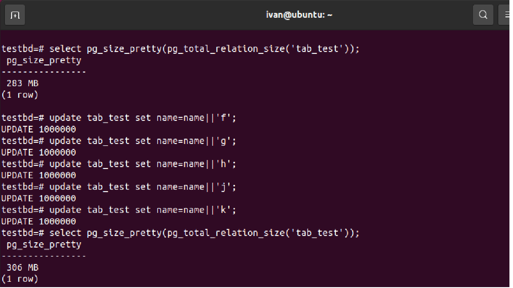
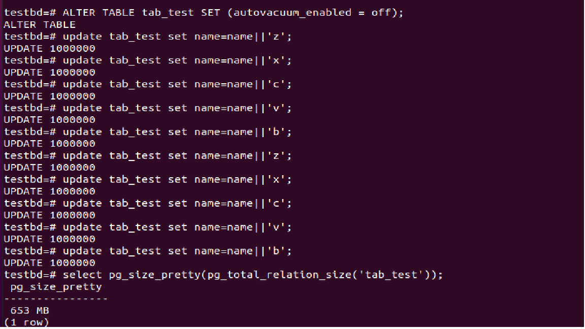

## **Настройка autovacuum с учетом особеностей производительности**

1. Создать инстанс ВМ с 2 ядрами и 4 Гб ОЗУ и SSD 10GB</br>
Создал</br>
2. Установить на него PostgreSQL 15 с дефолтными настройками</br>
Установлено</br>
3. Создать БД для тестов: выполнить pgbench -i postgres </br>
БД создана</br>
4. Запустить pgbench -c8 -P 6 -T 60 -U postgres postgres
 
5. Применить параметры настройки PostgreSQL из прикрепленного к материалам занятия файла
Протестировать заново</br>
```postgres
ALTER SYSTEM SET max_connections = 40; 
ALTER SYSTEM SET shared_buffers = '1GB'; 
ALTER SYSTEM SET effective_cache_size = '3GB'; 
ALTER SYSTEM SET maintenance_work_mem = '512MB';
ALTER SYSTEM SET checkpoint_completion_target = 0.9;
ALTER SYSTEM SET wal_buffers = '16MB'; 
ALTER SYSTEM SET default_statistics_target = 500; 
ALTER SYSTEM SET random_page_cost = 4;
ALTER SYSTEM SET effective_io_concurrency = 2;
ALTER SYSTEM SET work_mem = '6553kB';
ALTER SYSTEM SET min_wal_size = '4GB'; 
ALTER SYSTEM SET max_wal_size = '16GB';
```
6. Что изменилось и почему?
 
Изменения наблюдаются в tps. По default было 563, после изменения парамметров бвзы 555. 
Возможно изменений не наблюдается в виду того, что пустая база!?</br>
7. Создать таблицу с текстовым полем и заполнить случайными или сгенерированными данным в размере 1млн строк
```postgres
CREATE TABLE tab_test (num int, name varchar);
INSERT INTO tab_test (num,name) SELECT generate_series, 'test'||generate_series FROM generate_series(1,1000000) ;

```
8. Посмотреть размер файла с таблицей
```postgres
select pg_size_pretty(pg_total_relation_size('tab_test'));
```

**Итого: 42 MB** </br>
9. 5 раз обновить все строчки и добавить к каждой строчке любой символ</br>
```postgres
update tab_test set name=name||'a';
update tab_test set name=name||'b';
update tab_test set name=name||'c';
update tab_test set name=name||'d';
update tab_test set name=name||'e';
```

**Размер стал 283 MB**</br>
10. Посмотреть количество мертвых строчек в таблице и когда последний раз приходил автовакуум
```postgres
SELECT relname, n_live_tup, n_dead_tup, trunc(100*n_dead_tup/(n_live_tup+1))::float "ratio%", last_autovacuum FROM pg_stat_user_TABLEs WHERE relname = 'tab_test';
```

Колич. мертвых записей: **0**</br>
Автовакуум последний раз прошел: **2023-05-13 15:54:42.295648+04**</br>
11. Подождать некоторое время, проверяя, пришел ли автовакуум</br>
Автовакуум прошел</br>
12. 5 раз обновить все строчки и добавить к каждой строчке любой символ
```postgres
update tab_test set name=name||'f';
update tab_test set name=name||'g';
update tab_test set name=name||'h';
update tab_test set name=name||'j';
update tab_test set name=name||'k';
```
13. Посмотреть размер файла с таблицей

**Размер: 306 MB**
14. Отключить Автовакуум на конкретной таблице
```postgres
ALTER TABLE tab_test SET (autovacuum_enabled = off);
```
15. 10 раз обновить все строчки и добавить к каждой строчке любой символ
```postgres
update tab_test set name=name||'z';
update tab_test set name=name||'x';
update tab_test set name=name||'c';
update tab_test set name=name||'v';
update tab_test set name=name||'b';
update tab_test set name=name||'z';
update tab_test set name=name||'x';
update tab_test set name=name||'c';
update tab_test set name=name||'v';
update tab_test set name=name||'b';
```
16. Посмотреть размер файла с таблицей
```postgres
select pg_size_pretty(pg_total_relation_size('tab_test'));
```

**Размер: 653 MB**</br>
17. Объясните полученный результат</br>
Значительное увеличение размера таблицы связано с тем, что при апдейте запись не удаляется полностью из базы, в придачу к этому создаются еще новые записи. Таким образом, в базе остались висеть "мертвые записи", которые занимают определенное количество памяти.</br>
18. Не забудьте включить автовакуум
```postgres
ALTER TABLE tab_test SET (autovacuum_enabled = on);
```
