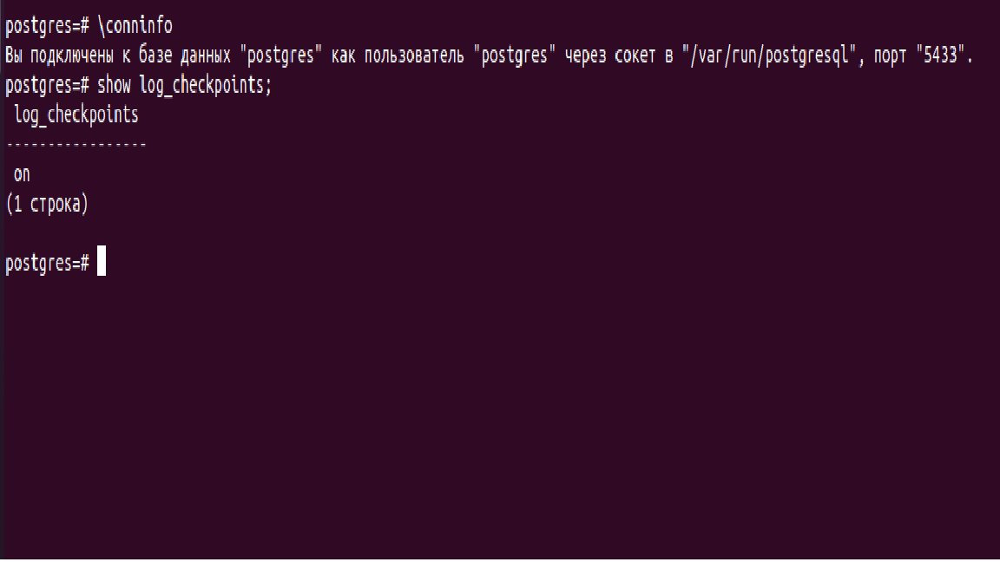
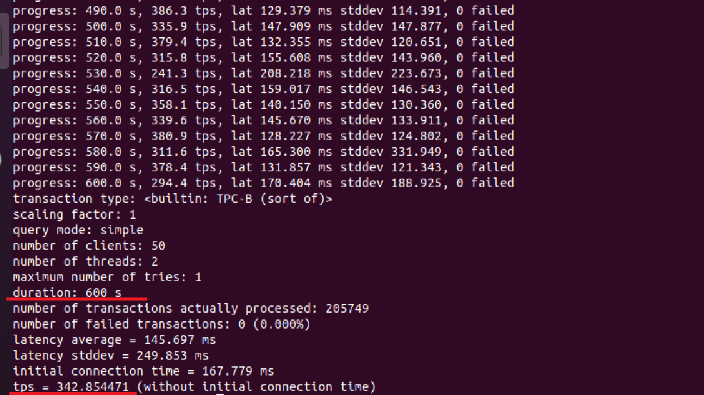
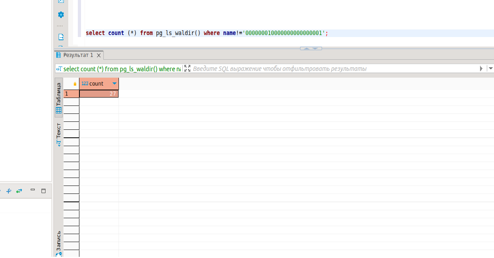
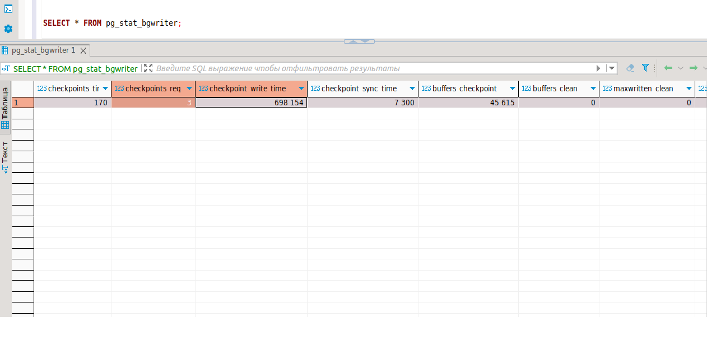
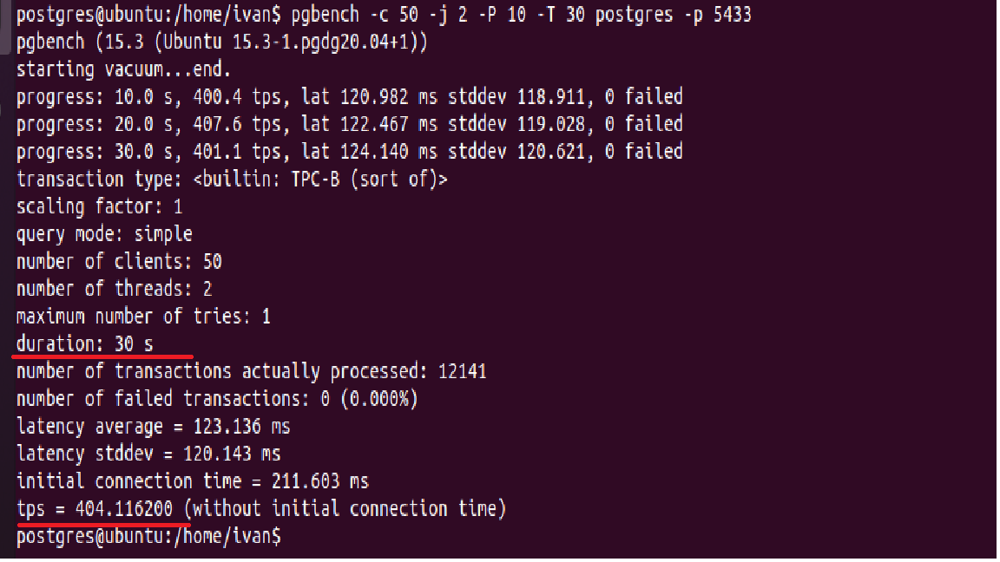
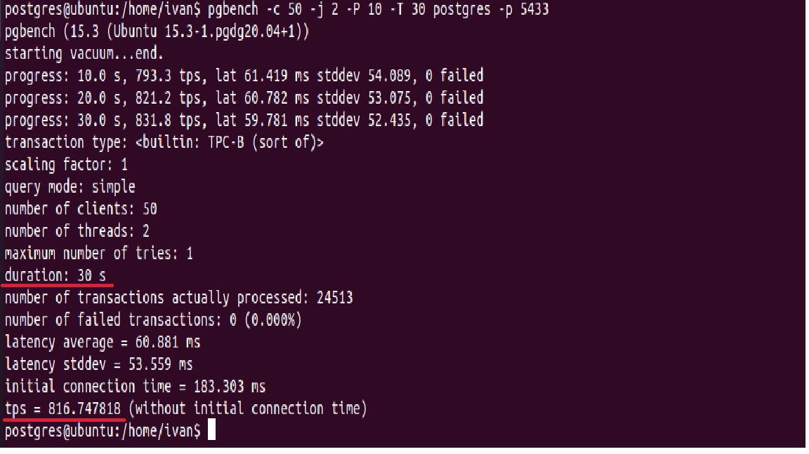

## **Работа с журналами**

**1. Настройте выполнение контрольной точки раз в 30 секунд.**</br>
 

```postgres
alter system set checkpoint_timeout='30s';
---рестартанем кластер
sudo pg_ctlcluster 15 main2 restart
show checkpoint_timeout;
```
**2. 10 минут c помощью утилиты pgbench подавайте нагрузку.**</br>

Посмотрим, какие у нас файлы журналов имеются:
```postgres
select * from pg_ls_waldir();
```
Имеется один файл:  000000010000000000000001 

```postgres
pgbench -i postgres -p 5433
pgbench -c 50 -j 2 -P 10 -T 600 postgres -p 5433
```
 
**3. Измерьте, какой объем журнальных файлов был сгенерирован за это время. Оцените, какой объем приходится в среднем на одну контрольную точку.**</br>

```postgres
select count (*) from pg_ls_waldir() where name!='000000010000000000000001';
```
 

Итого, было сформировано 27 журнальных файлов.

За все время тестов 10 мин. у нас должно быть 20 контрольных точек. 

**4. Проверьте данные статистики: все ли контрольные точки выполнялись точно по расписанию. Почему так произошло?**</br>

```postgres
SELECT * FROM pg_stat_bgwriter;
```
 
Из статистики видно, что по расписанию checkpoints_timed за все время было выполнено 170 контрольных точек.</br>
Кроме этого 3 контрольные точки были выполнены по требованию checkpoints_req=3.Но это старые контрольные точки, не связанные с данным тестированием.</br>

Таким образом, контрольные точки происходят по расписанию: раз в checkpoint_timeout единиц времени. Но теоретически, при повышенной нагрузке контрольные точки могут вызываться чаще, при
достижении объема max_wal_size.

**5. Сравните tps в синхронном/асинхронном режиме утилитой pgbench. Объясните полученный результат.**</br>
Сначала погоняем тесты в синхронном режиме 30 секунд:
```postgres
alter system set synchronous_commit='on';
pgbench -c 50 -j 2 -P 10 -T 30 postgres -p 5433
```
 
Теперь попробуем в асинхронном режиме протестировать:
```postgres
alter system set synchronous_commit='off';
sudo pg_ctlcluster 15 main2 restart
pgbench -c 50 -j 2 -P 10 -T 30 postgres -p 5433
```
 

В синронном режиме tps= 404, а в асинхронном режиме tps = 816 (в два раза больше операций обрабатывается !!!). 

Увеличение количества обработанной информации за единицу времени связано с тем, что в асинхронном режиме фиксация изменений не ждет записи на диск.

**6. Создайте новый кластер с включенной контрольной суммой страниц. Создайте таблицу. Вставьте несколько значений. Выключите кластер. Измените пару байт в таблице. Включите кластер и сделайте выборку из таблицы. Что и почему произошло? как проигнорировать ошибку и продолжить работу?**</br>
```postgres
sudo pg_ctlcluster 15 main2 stop
---проверяем:
sudo su - postgres -c '/usr/lib/postgresql/15/bin/pg_controldata -D "/var/lib/postgresql/15/main2"' | grep state
---выдал ответ:  Database cluster state:               shut down
---включаем контрольные суммы:
sudo su - postgres -c '/usr/lib/postgresql/15/bin/pg_checksums --enable -D "/var/lib/postgresql/15/main2"'
```
Результат: 
```
Checksum operation completed
Files scanned:   1269
Blocks scanned:  6305
Files written:  1049
Blocks written: 6305
pg_checksums: syncing data directory
pg_checksums: updating control file
Checksums enabled in cluster
```
Запускаем кластер:
```postgres
sudo pg_ctlcluster 15 main2 start
```
Создаем таблицу:
```postgres
CREATE TABLE test(i int, name varchar);
INSERT INTO test 
SELECT s.id,md5(id::varchar) FROM generate_series(1,100) AS s(id); 

SELECT pg_relation_filepath('test');  ---получаем значение: base/5/16398
```
-- Остановим сервер и поменяем несколько байтов в странице (сотрем из заголовка LSN последней журнальной записи)
```postgres
sudo pg_ctlcluster 15 main2 stop
sudo dd if=/dev/zero of=/var/lib/postgresql/15/main2/base/5/16398 oflag=dsync conv=notrunc bs=1 count=8
```
Получаем:
```
8+0 записей получено
8+0 записей отправлено
8 байт скопировано, 0,0102996 s, 0,8 kB/s
```
Включаем и смотрим таблицу:
```postgres
sudo pg_ctlcluster 15 main2 start
select * from test;
```
Получаем предупреждение:
```
ПРЕДУПРЕЖДЕНИЕ:  ошибка проверки страницы: получена контрольная сумма 47457, а ожидалась - 28301
ОШИБКА:  неверная страница в блоке 0 отношения base/5/16398
```
Проблема в том, что мы испортили заголовок страницы.</br>
Чтобы прочитать, нужно изменить параметр ignore_checksum_failure, который позволяет попробовать прочитать таблицу, но с риском получить искаженные данные.

```postgres
alter system set ignore_checksum_failure=on;
select * from test;
```
