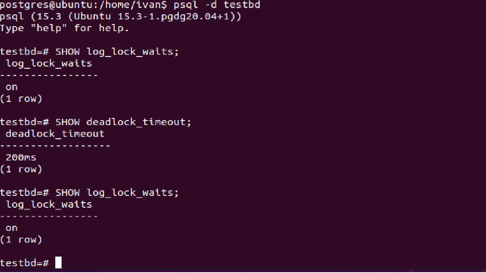
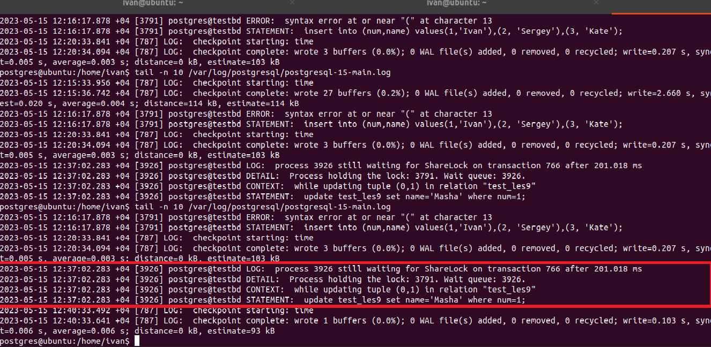
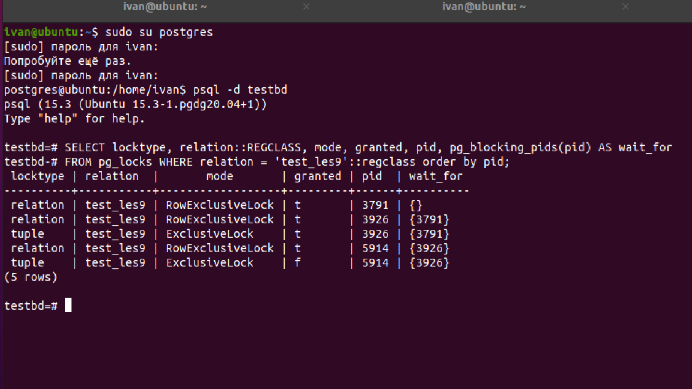
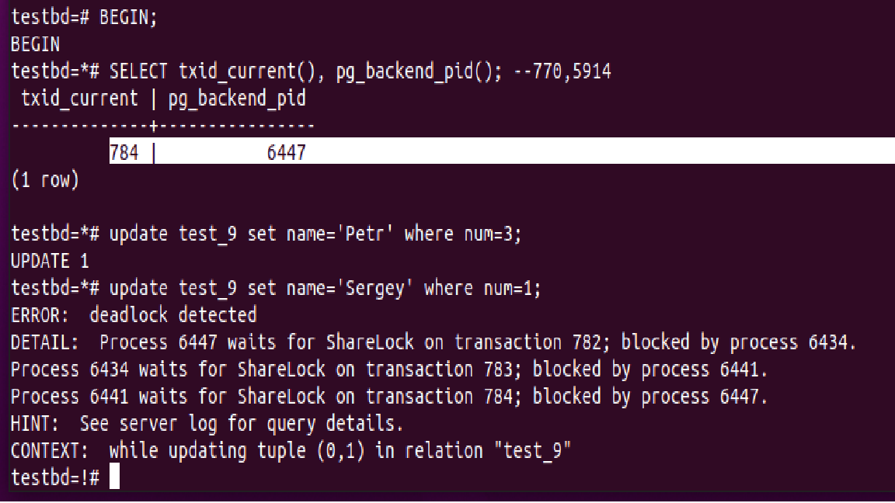
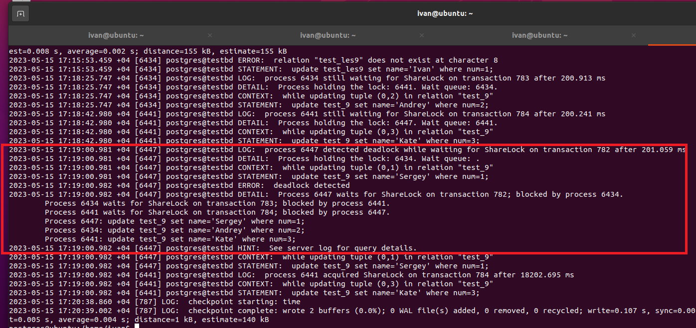

## **Работа с журналами**

**1. Настройте сервер так, чтобы в журнал сообщений сбрасывалась информация о блокировках, удерживаемых более 200 миллисекунд. Воспроизведите ситуацию, при которой в журнале появятся такие сообщения.**</br>
```postgres
SHOW log_lock_waits; 
SHOW deadlock_timeout; 
ALTER SYSTEM SET log_lock_waits=on;
ALTER SYSTEM SET deadlock_timeout = '200ms';
SELECT pg_reload_conf();
SHOW log_lock_waits; 
SHOW deadlock_timeout; 

---создвем таблицу----
create table test_les9 (num int, name varchar);
insert into test_les9 (num,name) values(1,'Ivan'),(2, 'Sergey'),(3, 'Kate');

---смотрим есть ли блокировки:
SELECT locktype, relation::REGCLASS, mode, granted, pid, pg_blocking_pids(pid) AS wait_for
FROM pg_locks WHERE relation = 'test_les9'::regclass order by pid;
---блокировок нет

---в первой сессии запускаем транзакцию---
BEGIN;
update test_les9 set name='Olga' where num=1;

--Во второй сессии запускаем тоже транзакцию
BEGIN;
update test_les9 set name='Masha' where num=1;

---Смотрим, что получилось: 
tail -n 10 /var/log/postgresql/postgresql-15-main.log
```
 


**2. Смоделируйте ситуацию обновления одной и той же строки тремя командами UPDATE в разных сеансах. Изучите возникшие блокировки в представлении pg_locks и убедитесь, что все они понятны. Пришлите список блокировок и объясните, что значит каждая.**</br>
```postgres
---в первом сеансе
BEGIN;
SELECT txid_current(), pg_backend_pid(); --768,3791
update test_les9 set name='Ivan' where num=2;

---в втором сеансе
BEGIN;
SELECT txid_current(), pg_backend_pid(); --769,3926
update test_les9 set name='Petr' where num=2;

---в третьем сеансе
BEGIN;
SELECT txid_current(), pg_backend_pid(); --770,5914
update test_les9 set name='Andrey' where num=2;

```
Вторая и третья транзакция повисает, так как ждет, когда закончится первая транзакция.</br>
Посмотрим, что пишется pg_locks

Итого, мы видим, что первая транзакция 3791, не завершена имеется RowExclusive-блокировка (т.е. блокировка строки).</br>
Втора транзакция 3926 ожидает выполнения первой wait_for={3791}. Имеется одна RowExclusive-блокировка (т.е. блокировка строки) и еще блокировка (tuple), которая также ссылается на первую стороку wait_for={3791}.</br>
Третья транзакция 5914 ожидает выполнения второй wait_for={3926} и содержит tuple, который ссылается на tuple из второй транзакции wait_for={3926}.</br>
Последующие сессии, если бы мы их создали также содержали бы tuple, который ссылался бы на tuple из второй транзакции.</br>
**3. Воспроизведите взаимоблокировку трех транзакций. Можно ли разобраться в ситуации постфактум, изучая журнал сообщений?**</br>
```postgres
-----изменения в разных строках---
---создвем таблицу----
create table test_9 (num int, name varchar);
insert into test_9 (num,name) values(1,'Ivan'),(2, 'Sergey'),(3, 'Kate');


-- Session #1
BEGIN;
SELECT txid_current(), pg_backend_pid(); --782 |           6434

update test_9 set name='Ivan' where num=1;

-- Session #2
BEGIN;
SELECT txid_current(), pg_backend_pid(); --783 |           6441
update test_9 set name='Olga' where num=2;

-- Session #3
BEGIN;
SELECT txid_current(), pg_backend_pid(); --784 |           6447
update test_9 set name='Petr' where num=3;

----изменения по второму кругу----------
-- Session #1
update test_9 set name='Andrey' where num=2;

-- Session #2
update test_9 set name='Kate' where num=3;

-- Session #3
update test_9 set name='Sergey' where num=1;
```
Выдал след. сообщение в третьей транзакции:


В ситуации можно разобраться смотря в журнал


**4. Могут ли две транзакции, выполняющие единственную команду UPDATE одной и той же таблицы (без where), заблокировать друг друга?**</br>
Да, могут. Если идет обновление всей таблицы. Одна команда Update обновляет таблицу с одной стороны, а другая команда Update c другой стороны. ВОт и получается взаимоблокировка.