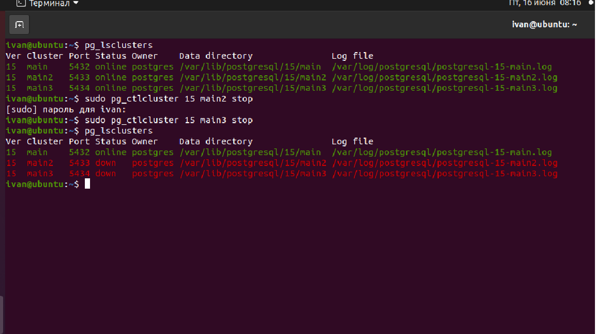
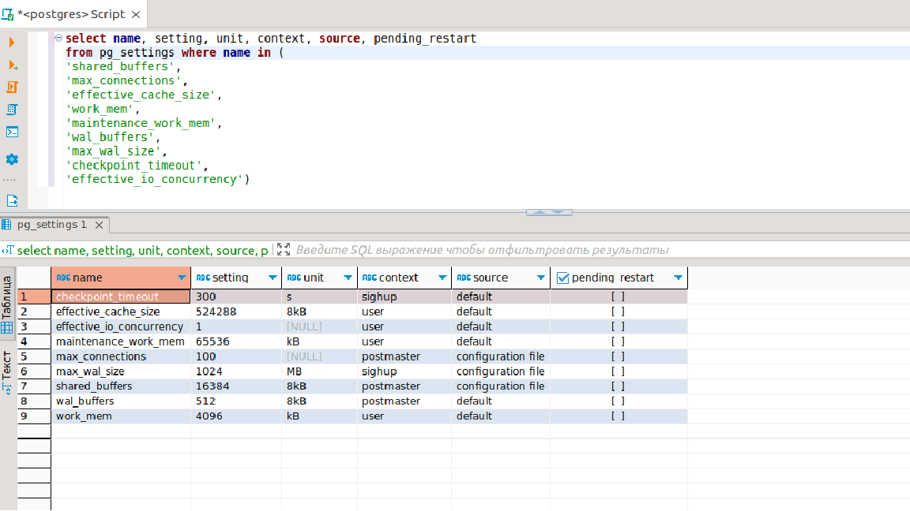
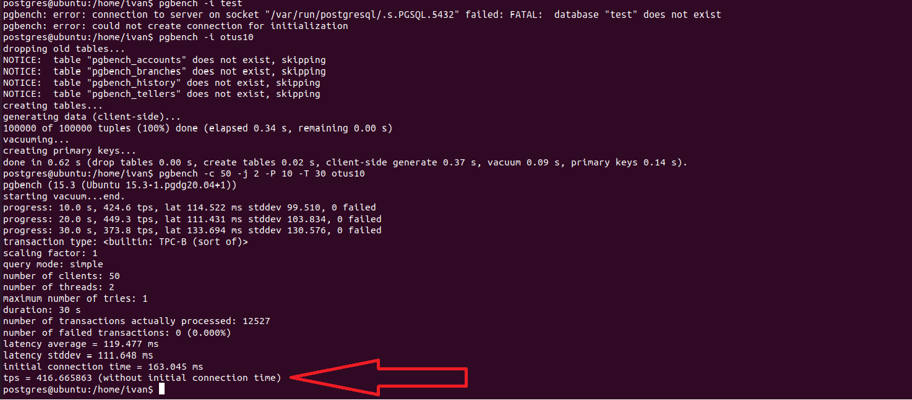
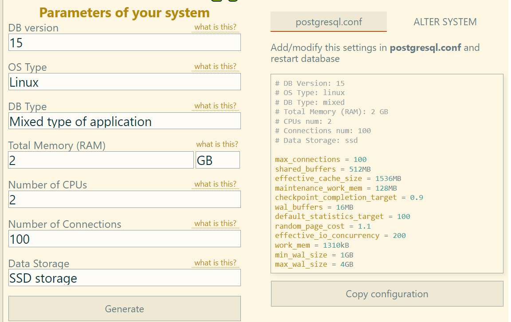
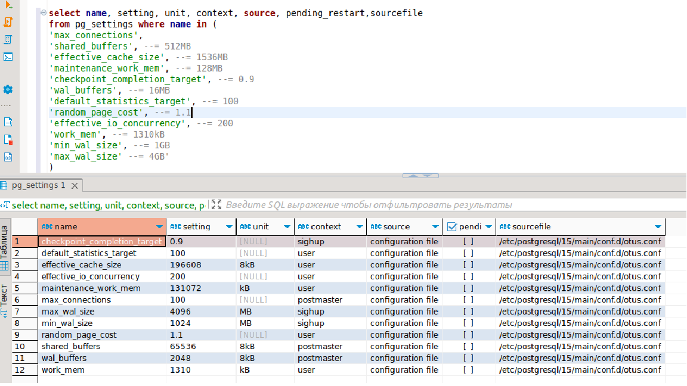
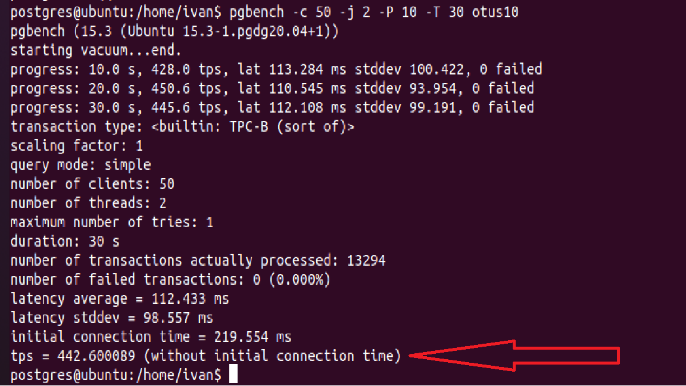

## **Нагрузочное тестирование и тюнинг PostgreSQL**

**1. развернуть виртуальную машину любым удобным способом**</br>
Развернул Виртуальную машину в Virtual Box

**2. поставить на неё PostgreSQL 15 любым способом**</br>
Развернули кластер на порту 5432:

 

**3. настроить кластер PostgreSQL 15 на максимальную производительность не обращая внимание на  возможные проблемы с надежностью в случае аварийной перезагрузки виртуальной машины**</br>

посмотрим, как настроены основные пераметры по умолчанию:
Смотрим, где распологается наш конфиг файлик:
```postgres
show config_file;
```
Выдает путь: **/etc/postgresql/15/main/postgresql.conf**

 

Попробуем сначала нагрузить Базу со стандартными настройками:

```
pgbench -c 50 -j 2 -P 10 -T 30 otus10
```

 
Получили **tps = 416** транзакций в секунду.
Попробуем протюнить нашу базу через https://pgtune.leopard.in.ua/: 
 

В директории /etc/postgresql/15/main/conf.d/</br>
создаем конфиг файл otus.conf и заливаем туда наши настройки и сохраняем файл:
```
max_connections = 100
shared_buffers = 512MB
effective_cache_size = 1536MB
maintenance_work_mem = 128MB
checkpoint_completion_target = 0.9
wal_buffers = 16MB
default_statistics_target = 100
random_page_cost = 1.1
effective_io_concurrency = 200
work_mem = 1310kB
min_wal_size = 1GB
max_wal_size = 4GB
```
Перезагружаем кластер
```
sudo pg_ctlcluster 15 main restart
```
Смотрим, что параметры применились:
 

Видно, что настройки применяются из созданного нами конфиг. файла: otus.conf

**4. нагрузить кластер через утилиту через утилиту pgbench**</br>

 

Получили: 442 транзакции в секунду.
Увлечим значение shared_buffers до 40% от общей памяти: **800MB** и перезакгрузим кластер.</br>
Получаем значение tps=424. Т.е. в нашем случае повышать данный параметр выше чем на 25% нет смысла. Вернем обратно на 512MB.</br>

Меняем параметр synchronous_commit='off'
```postgres
alter system set synchronous_commit='off';
```
Запускаем тесты:</br>
Тест показал tps=693, таким образом убеждаемся, что в асинхронном режиме скорость обработки увеличивается, что является хорошим решением для некритичных данных. 

Уменьшим параметр 
```postgres
alter system set max_connections='60'
```
Тест показал незначительное уменьшение tps = 399, скорее всего связано с тем, что у нас синтетический тест.

**5. написать какого значения tps удалось достичь, показать какие параметры в какие значения устанавливали и почему**</br>
Согласно документации, рекомендуемое значение для shared_buffers - 25% от общей оперативной памяти на сервере. Поэтому оптимальное значение 512MB.

При асинхронном режиме скорость обработки значительно увеличивается, что подтверждается тестом, поэтому, если в базе не критичные данные, то можно устанавливать асинхронный режим.

В целом лучший показатель, который получил это tps=693 в асинхронном режиме.